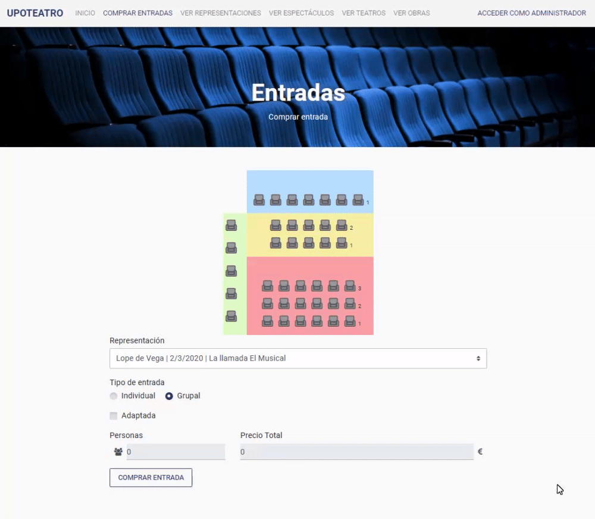

# UpoTeatro  
### A Client-Side Development Project in JavaScript  

**UpoTeatro** is a web application designed to manage multiple theaters, including their shows and ticketing systems.  

This project was developed by a team of students from the **Universidad de Pablo Olavide**.  
You can find the project documentation here: [Documentation](Documentación/UPOTEATRO.pdf)  

View the class diagram: [Class Diagram](Documentación/Diagrama.pdf)  

## Classes  

- **UpoTeatro:**  
  Manages all system-wide information.  

- **Teatro:**  
  Represents a theater with its name, address, shows, and seating.  

- **Butaca (Seat):**  
  Represents a specific seat in a theater, defined by its row, zone, and number.  

- **Representaciones (Shows):**  
  Represents a show with its scheduled date and related spectacle.  

- **Espectaculo (Spectacle):**  
  Represents performances defined by the play and the performing company.  

- **Compania (Company):**  
  A database of companies, including their NIF, name, and director.  

- **Obra (Play):**  
  A database of plays, including their titles and authors.  

- **Entrada (Ticket):**  
  Defines a ticket for a specific show in a theater. The ticket price is determined by the seat's zone and the base price of the show. For group tickets, pricing is calculated based on the number of people and the base price.  

---

## Application Structure  

### Core Pages:  
- **index.html:**  
  The main page of the application, featuring a dynamic section for forms and listings.  

- **formularios.html:**  
  Contains various forms, dynamically loaded into the main page.  

- **navAdmin.html:**  
  A special navigation bar replacing the default one for administrators after login.  

---

## Initial Data  

The application includes XML files with initial data to be loaded at startup:  
- **teatros.xml:** Theater data.  
- **representaciones.xml:** Show data.  
- **espectaculos.xml:** Spectacle data.  
- **entradas.xml:** Ticket data.  
- **butacas.xml:** Seat data.  
- **compañias.xml:** Company data.  
- **obras.xml:** Play data.  

---

## Code Organization  

The codebase is divided into multiple files to improve readability:  

- **claseUpoTeatro.js:**  
  Defines the `UpoTeatro` class and its methods.  

- **clases.js:**  
  Defines other classes in the application.  

- **cargaDatos.js:**  
  Reads the initial XML files and loads the data into the class model.  

- **modificarVista.js:**  
  Handles dynamic web updates depending on the current section.  

- **sesion.js:**  
  Manages user login and logout.  

- **principal.js:**  
  Validates forms and integrates new data into the system.  

- **multiusos.js:**  
  Contains utility functions applicable to various projects.  